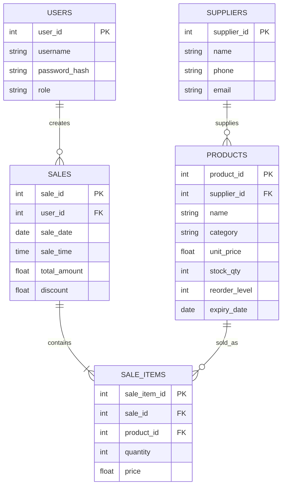

```mermaid
erDiagram
 USERS ||--o{ SALES : creates
 SALES ||--|{ SALE_ITEMS : contains
 PRODUCTS ||--o{ SALE_ITEMS : sold_as
 SUPPLIERS ||--o{ PRODUCTS : supplies
 USERS { int user_id PK
 string username
 string password_hash
 string role }
 PRODUCTS { int product_id PK
 int supplier_id FK
 string name
 string category
 float unit_price
 int stock_qty
 int reorder_level
 date expiry_date }
 SALES { int sale_id PK
 int user_id FK
 date sale_date
 time sale_time
 float total_amount
 float discount }
 SALE_ITEMS { int sale_item_id PK
 int sale_id FK
 int product_id FK
 int quantity
 float price }
 SUPPLIERS { int supplier_id PK
 string name
 string phone
 string email }
```